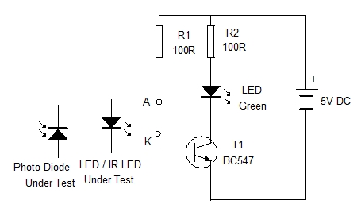

## Electronic

### Circuit - 1
- IR Sensor Resistor 100R
- Led Resistor 150R
- Transistor BC337 CBE

### Circuit - 3 - VS1838B

## Software

### Brainstorming
- [Github Arduino-IRremote](https://github.com/Arduino-IRremote/Arduino-IRremote) Remote for TV and so on
- [low level github project](https://github.com/cyborg5/IRLib2)
- For Prototyping a small Arduino with only receiving the ir signal by VS1838B and forward to serial should sufficient

## Journal

### 15.01.2025

- test against real marker showed, no improvement needed. Circuit 1 works fine.
- 3d test prints ongoing
  - add holes for mounting
  - add space for the pcb
  - add holes to save filament
  - 